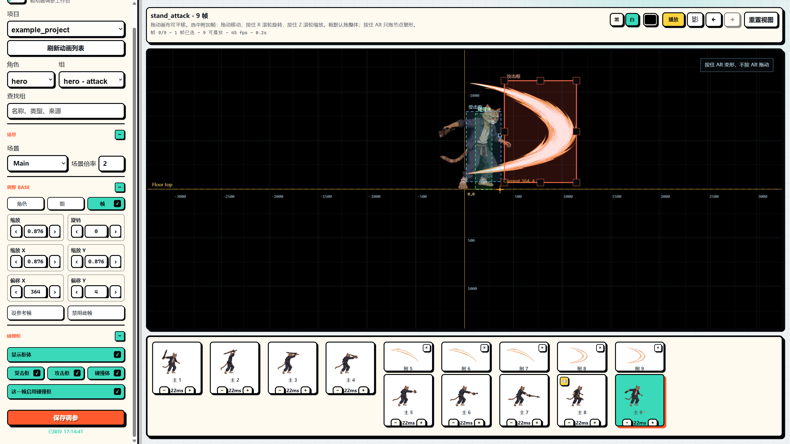
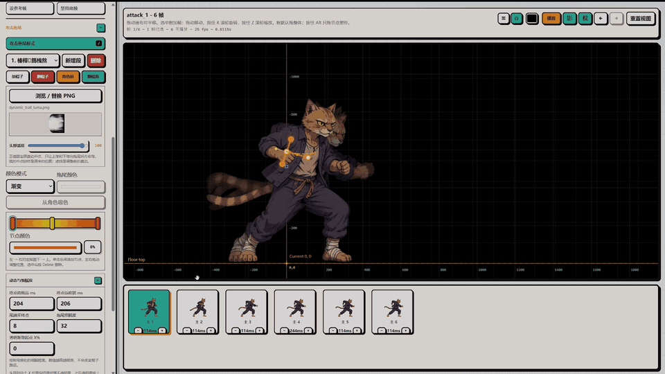

# FrameDock

FrameDock 是本地序列帧工作台：给 Godot / Unity 角色调参、给 Codex 宠物回写图集，也给不绑游戏的素材做透明导出。Agent 负责导入、同步和验证；人在浏览器里看帧、叠图层、剪时间线、调碰撞框。配套 Codex/Agent skill 的 id 仍是 `xsxb-frame-tuner`。

仓库同时提供完全隔离的 **FrameDock Lite**：不绑定任何游戏工程，把 PNG 序列或带 JSON 的 Sprite Sheet 编成统一透明画布的多图层序列，并导出新的 PNG / Sheet。



## 两个版本

| | **完整版** | **Lite** |
|---|---|---|
| 启动 | `start_xsxb_frame_tuner.bat` 或 `npm start` | `start_xsxb_frame_tuner_lite.bat` 或 `npm run start:lite` |
| 地址 | http://127.0.0.1:5179 | http://127.0.0.1:5180 |
| 项目 | 绑定一个 Godot（`project.godot`）或 Unity（`Assets/` + `ProjectSettings`）根目录 | 独立素材项目，可 `XSXB_LITE_ROOT` 指向外部数据盘 |
| 编辑 | 胶片条、组合时间线、QWER、Photopea、碰撞框、音效、挂件、攻击拖尾 | 同一套编辑器，含组合时间线与导出 |
| 输出 | 保存后同步 Godot / Unity runtime | 用户自选目录导出透明 PNG 或 Sheet + JSON |
| 不做 | — | 不改完整版项目列表，不同步游戏工程 |

两边共用同一份网页编辑器。Codex 宠物只出现在完整版，且隐藏组合时间线、序列增删、打开游戏工程和 Photopea 写回。

## 能做什么

- **多项目隔离**：每个游戏工程（或 Lite 素材根）使用独立的 manifest、tuning、音频、挂件和导入目录。侧栏「打开项目」浏览本机文件夹；完整版绑定 Godot / Unity 根，Lite 可新建或发现 `data/lite/projects/<id>`。
- **组合时间线**：把多条序列帧（角色 + 特效）叠在同一毫秒时间线上预览和导出。交互对照 [OpenCut classic](https://github.com/OpenCut-app/opencut-classic)（缩放、磁铁、分割、实时拖裁），素材仍是序列帧，不是视频。不嵌入 React OpenCut。
- **胶片条**：卡片上方 `⋮⋮` 重排帧序，`×` 删除（需确认，至少留一帧），`+` 插入空白透明 PNG。图层上下仍用竖向拖动，不要拖主缩略图排帧。
- **画布 QWER**：Q 选择、W 移动、E 旋转、R 缩放；O 拖变换枢轴。中键只平移；右键菜单。Ctrl+Z/Y 撤销重做，Ctrl+C/V/D 复制粘贴/复制一份，Delete 删除。
- **Photopea**：把当前帧主图和附加层作为未变换源 PNG 送进编辑，写回只换像素，不叠 Tuner 里已有的缩放/偏移。
- **三层变换**：角色、动画组、单帧分别保存缩放、偏移、旋转和禁用。
- **碰撞框**：hurtbox / hitbox / collisionbox，画布上直接拖变形。
- **帧音效与图片挂件**：绑到指定帧；完整版保存后同步到游戏项目，Lite 随导出包带走。
- **攻击拖尾**：棍子画轨迹，再按人物帧插入可拖首尾的静态拖尾。
- **Codex 宠物**：自动收集内置宠物和 `~/.codex/pets` 自定义宠物；支持 8×9 的 v1 图集和带 16 个视线方向的 v2 图集。自定义宠物保存回 `spritesheet.webp` 并保留备份；内置宠物只读。
- **Godot / Unity runtime**：导入后生成引擎侧数据和播放器；游戏工程不直接播放组合时间线的 clip 列表，只播放烘焙后的普通序列。

这个仓库不包含角色 PNG、音频、游戏工程路径或调参数据。运行时项目数据留在本机，并被 `.gitignore` 排除。

## 组合时间线

组合序列（`group.kind = "composite"`）和「附加图层」不是同一件事。时间线里的每一段 clip 只**引用**已有序列，按毫秒叠在舞台上一起播。加入一条序列默认新建一层；同一轨也可以左右并排放不重叠的 clip。后面的轨道画在前面。

**怎么建**

- 大纲：**基于此素材新建组合序列** / **新建组合序列**
- Lite 导入面板还可：**新建组合序列（空时间线）**
- 把 PNG 文件夹拖到组合画布或时间线上，会先导入再加 clip
- **加入时间线** 列出项目里所有普通序列（按素材集分组，当前集优先），包括特效包

**怎么剪**

- 胶片条区域变成多轨 NLE：工具条（分割 / 复制 / 复制一份 / 删除 / 磁铁 / 缩放）、毫秒标尺、播放头
- Ctrl+滚轮以光标为锚缩放；Shift 或横向滚轮平移
- 拖 clip 改开始时间或换轨；拖到最后一行下面新建图层；拖两端按源帧边界裁切
- 拖轨道手柄改前后；眼睛隐藏整轨；右键可隐藏选中 clip
- **S** 或剪刀在播放头处切开（Ctrl+S 仍是保存）
- 隐藏的 clip / 轨道不进预览，也不进烘焙

**导出时发生什么**

保存（完整版）和 Lite 的 PNG / Sheet 导出会把时间线**烘焙成一条普通 PNG 序列**。Godot / Unity 只播这条烘焙结果。不要嵌套组合；框体、音效、拖尾仍写在源序列上，采样到那一帧时画进预览和烘焙图。

## 攻击拖尾模式

选择角色和动作后开启“攻击拖尾模式”，再选择“拖尾绘制”或“拖尾插入”。绘制模式编辑与整组动作绑定的完整轨迹，不受当前人物帧限制；插入模式只决定当前人物帧显示轨迹的哪一段。

- “拖尾绘制”显示完整参数区。棍子操作栏使用 `＋`、`－`、前后图层、翻面和平滑轨迹；进入时默认显示完整拖尾，点击任意棍子会预览头部到达该棍的位置。
- 画布播放键右侧的“拖尾预览”使用固定 1000ms 总时长和 0.5 尾/头速度比，只用于检查绘制轨迹，不写入正式结果。
- “拖尾插入”只显示“本帧加入拖尾”。加入后直接沿轨迹拖动“尾”和“头”，该帧保存的首尾位置就是正式播放结果。
- 画布右上角“棍”控制绘制手柄，“轨”控制轨迹虚线；隐藏虚线不会影响拖尾本身。
- 每根棍子都可独立切换“角色前方/角色后方”，因此一段拖尾可以在运动途中穿过角色图层。
- 每个动作可以保存多段互不相关的拖尾；纹理可一键反色，颜色、渐变节点、头部弧度、透明渐隐、尾端采样点和细腻度都可以重新编辑。
- 默认附带 `dynamic_trail_luma.png` 预设。点击拖尾栏的“保存”可将当前纹理、单色/渐变配色、头部弧度和拖尾参数另存为命名预设；名称留空时自动编号，原预设不会被覆盖，棍子路径也不会复制。
- 单色和渐变模式保留原贴图的灰度笔刷细节；原色模式要求带有效 Alpha 的 RGBA PNG。
- 保存时会保留可编辑轨迹和逐帧首尾位置，并同步 Godot 运行时；游戏中按人物帧播放对应拖尾层，不再依赖一套额外的追赶计时动画。
- “拖尾细腻度”默认值为 20，适合作为大多数帧动画的质量/性能平衡点；数值越高，弯曲更细但网格更新成本也更高。

[](docs/media/attack-trail-editor-demo.mp4)

README 会直接播放上方的轻量动态预览；点击动画可打开完整 720p MP4 演示。

## 一键启动

仓库根目录提供两个可直接双击的入口：

- `start_xsxb_frame_tuner.bat`：启动完整版并打开 `http://127.0.0.1:5179`
- `start_xsxb_frame_tuner_lite.bat`：启动 Lite 并打开 `http://127.0.0.1:5180`

两个入口会先关闭本仓库已运行的另一种 Tuner 模式，因此完整版和 Lite 不会在后台重复占用服务。Windows 快捷方式可以直接指向对应 BAT，并复用 `tools/animation_tuner/assets/xsxb-frame-tuner.ico` 作为图标。

需要指定 Lite 数据根时，在启动前设置 `XSXB_LITE_ROOT`（不要从页面里改这个路径）：

```powershell
$env:XSXB_LITE_ROOT = "D:\path\to\xsxb-lite"
npm run start:lite
```

## Unity runtime integration

FrameDock project bindings support `godot`, `unity`, `frame_lite`, and `codex_pets`. A Unity binding is isolated by its exact project root while it can deliberately share the same engine-neutral manifest and tuning data with the original Godot binding during migration.

Saving a Unity project copies all runtime assets into stable Unity-owned paths:

```text
Assets/XSXBFrameTuner/Frames/<project_id>/
Assets/XSXBFrameTuner/Audio/<project_id>/
Assets/XSXBFrameTuner/Attachments/<project_id>/
Assets/XSXBFrameTuner/AttackTrails/<project_id>/
Assets/XSXBFrameTuner/RuntimeData/<project_id>/
Assets/XSXBFrameTuner/Runtime/
```

`xsxb_runtime_data.json` is a derived Unity adapter over the existing authoritative `animation_manifest.json`, `animation_tuning.json`, frame SFX, attachments, and attack-trail JSON. It resolves real per-frame durations, disabled frames, transforms, facing, boxes, and stable Unity asset paths. `XsxbRuntimeImporter` automatically creates `xsxb_runtime_data.asset` after script reload and can also be run from **Tools > XSXB > Rebuild Runtime Databases**.

Attach `XsxbFramePlayer` to a Unity actor and assign the generated database. Replaying the same looping animation is idempotent; one-shot actions use `Play(animationId, false, true)` or `RestartAnimation()`. Gameplay can query `GetAnimationDurationSeconds()`, current hit/hurt/collision boxes, and the animation-finished event. Attack-trail data and timing are exposed through `IXsxbAttackTrailConsumer`; a project-specific Unity mesh/shader consumer is still required for final trail rendering. Composite timelines are baked to ordinary frame sequences before Unity sees them.

Validation commands:

```powershell
npm run validate:unity -- --project <unity_project_id>
npm run smoke:unity
```

## FrameDock Lite

Lite 与完整版共用编辑器、组合时间线、QWER 和攻击拖尾，但使用独立服务、独立项目列表和独立数据目录，不会修改 Godot / Unity 工程，也不会改变完整版当前选中的项目。侧栏可以「新建项目」或「打开项目」登记当前 Lite 根下 `data/lite/projects/<id>` 里的素材文件夹；不能从页面切换另一套 `XSXB_LITE_ROOT`。

Agent 可导入两类材料：

```powershell
# PNG 序列
node tools\frame_tuner_lite\import_frames.js --project demo --profile character --animation attack --source "D:\frames\attack" --fps 12

# PNG + JSON Sprite Sheet
node tools\frame_tuner_lite\import_sheet.js --project demo --profile character --animation attack --sheet "D:\sheet\attack.png" --json "D:\sheet\attack.json" --fps 12
```

多图层仍按序列管理。下面的导入会把 `weapon_glow` 放在 `attack` 后方；改为 `--layer front` 可放到前方，加入 `--independent` 可使用自己的播放时间轴：

```powershell
node tools\frame_tuner_lite\import_frames.js --project demo --profile character --animation weapon_glow --source "D:\frames\glow" --fps 12 --attach-to attack --layer behind
```

启动：

```powershell
npm run start:lite
# http://127.0.0.1:5180
```

Windows 下也可以直接双击仓库根目录的 `start_xsxb_frame_tuner_lite.bat`。

导入阶段不要求用户预先决定统一画布。先在页面里校准当前角色的所有动作、图层、组合时间线、逐帧音效和拖尾；“透明序列导出”会扫描该角色全部主动作组的实际可见像素范围，加入可调透明边距，再自动得到一个不会裁切且尽量紧凑的全角色统一画布。所有动作共享这个尺寸和同一个角色原点，切换动作时不会跳位。

Lite 中的拖尾棍子只负责绘制空间轨迹，只有在“拖尾插入”中明确加入当前人物帧的拖尾范围才会显示和导出。每张可播放源帧始终只生成一张最终烘焙帧，主帧、附加帧和该帧拖尾会合成到同一张透明 PNG。组合序列在导出时按毫秒采样重叠 clip，同样烘焙成一条普通序列，不要把源素材组再导出一遍（除非它们自己是没有 `previewOwner` 的主动作）。

把音频文件拖到帧卡即可绑定并预览，点击帧卡上的喇叭可以删除。点击任一导出按钮都会先打开系统文件夹选择器，不会写入固定的 Lite 内部路径。“导出 PNG 序列”为当前角色的每个主动作分别写逐帧透明 PNG，并用 `export.json` 作为唯一描述文件；“导出 Sheet + JSON”为每个主动作只写 `spritesheet.png` 和可被 Lite 重新导入的 `spritesheet.json`，不再生成重复的 `export.json`。批次根目录还会写一份 `lite-export.json`。Sheet 的帧时长、源帧映射和音效都以 `spritesheet.json` 为唯一权威。附属图层会合成进所属主动作，不会被重复导出成另一组。两种导出都会把实际使用的音频复制到批次根目录的 `audio/`。

要继续改已经导出的资产，在「导入素材」里将来源选成「Lite 导出包（反向导入）」，选择那次导出的批次文件夹（不要只选某一个动作子目录），即可把各组 Sheet/序列、音效和画布导回编辑器。因为导出图已经烘焙过变换，建议新建素材集导入，避免叠加上旧的角色/组偏移。Agent 再次导入 Sheet 时也会从 `spritesheet.json` 恢复音频文件和帧卡绑定。

Lite 本地数据保存在：

```text
data/lite/projects/<project_id>/
workspace/lite/projects/<project_id>/assets/
```

这些目录均被 Git 忽略。导出文件保存在用户通过系统选择器指定的目录。完整 Agent 导入与验收约定见 `skills/xsxb-frame-tuner/references/lite-contract.md`。

## 仓库内容

- `tools/animation_tuner/`：本地 Webapp（完整版默认 `http://127.0.0.1:5179`）
- `tools/animation_tuner/public/composite_timeline.js`：组合时间线视图（OpenCut 式缩放 / 磁铁 / 分割）
- `tools/animation_tuner/public/composite_sequence.js`：clip / track / 烘焙数据模型
- `tools/frame_tuner_lite/`：Lite 导入、独立服务与透明导出（默认 `http://127.0.0.1:5180`）
- `tools/import_frames.js` / `import_batch.js` / `import_spriteframes.js`：Agent 导入工具
- `tools/validate_import.js`：验证独立 tuner 与游戏工程的接线
- `tools/godot_sync.js`、`tools/godot_runtime.js`、`tools/unity_runtime.js`：引擎同步
- `skills/xsxb-frame-tuner/`：配套 Codex/Agent skill
- `data/`、`workspace/`、`audio/`：本机运行时目录，不提交

## 安装方式

只提供 Agent 安装方式。把下面这段话交给 Codex 或其他支持 skills 的 Agent：

```text
请从 https://github.com/sparklecatta-lang/XSXB-Frame-Tuner 安装并启用 `skills/xsxb-frame-tuner`。
安装后把仓库克隆到本机作为 FrameDock 工具根目录。
以后处理 Godot 帧动画角色导入、动画追加、组合时间线、碰撞框调参、音效/挂件同步时，默认使用 `$xsxb-frame-tuner`。
```

## 使用方式

安装后，建议继续用自然语言让 Agent 操作，不需要手动跑导入脚本。常用说法：

```text
用 $xsxb-frame-tuner 把 <Godot项目路径> 里的角色 SpriteFrames 接入 tuner。
```

```text
用 $xsxb-frame-tuner 给 <Godot项目路径> 的 hero 添加 idle 动画，PNG 序列在 <PNG序列路径>，12fps，导入后打开 tuner。
```

```text
用 $xsxb-frame-tuner 给 <Godot项目路径> 的 hero 一次加入 idle、run、jump、stand_attack，路径分别是 <四个PNG目录>，导入后检查每组框体并完整接入游戏。
```

```text
用 $xsxb-frame-tuner 把这几个特效 PNG 文件夹叠进当前角色的组合时间线，导出烘焙序列。
```

```text
用 $xsxb-frame-tuner 检查当前 Godot 项目的 XSXB runtime 是否和 tuner 保存的数据一致。
```

启动 Tuner 后，项目列表中的“Codex 宠物”会自动显示本机内置及自定义宠物。外部用 Hatch Pet 新建宠物后点击“刷新动画列表”即可看到；也可以点“导入新宠物”加入一个 1536×1872（v1）或 1536×2288（v2）的 WebP 图集。

Agent 会负责选择/创建项目、批量复制帧素材、生成 manifest、逐组检查初始框体、同步完整 runtime 到游戏工程、连接实际 gameplay，并在验证通过后启动 Webapp。打开页面后，人可以继续做艺术性微调并点击保存。

## 本地数据

完整版默认：

```text
data/projects/<project_id>/
workspace/projects/<project_id>/assets/
audio/projects/<project_id>/
```

Lite 默认：

```text
data/lite/projects/<project_id>/
workspace/lite/projects/<project_id>/assets/
```

这些目录会保存项目绑定、导入帧、attachments、音效和调参结果。它们默认不会进入 Git 仓库。

## 维护验证

代码没有外部运行依赖，只需要 Node.js 18+。维护者可以让 Agent 执行：

```powershell
npm run check
npm test
npm run validate:lite -- --project <lite_project_id>
```

对已绑定的 Godot 项目还可以运行：

```powershell
node tools\validate_import.js --project <xsxb_project_id> --project-root "<Godot项目路径>" --require-gameplay --strict
```

改网页 UI 或保存结构时，同时更新 `skills/xsxb-frame-tuner/references/ui-contract.md`（以及 Lite 的 `lite-contract.md`）。

## 自动更新

Tuner 页面每次打开后会检查官方 GitHub `main` 分支。发现新版本时，页面顶部会显示“更新并重启”按钮；点击后会快进更新本地 Tuner、同步仓库自带的 `xsxb-frame-tuner` skill、重启本地服务并自动重新连接。

为保护本地工作，自动更新只接受官方仓库、`main` 分支和没有未提交代码修改的工作区；Tuner 内有未保存的调参时按钮也会保持禁用。运行时项目数据和未跟踪素材不会被覆盖。

## License

MIT

<!-- updater smoke-test marker -->
