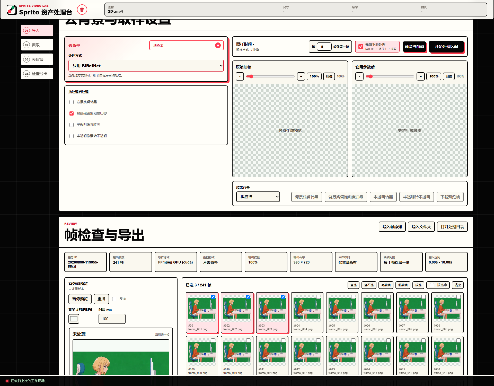
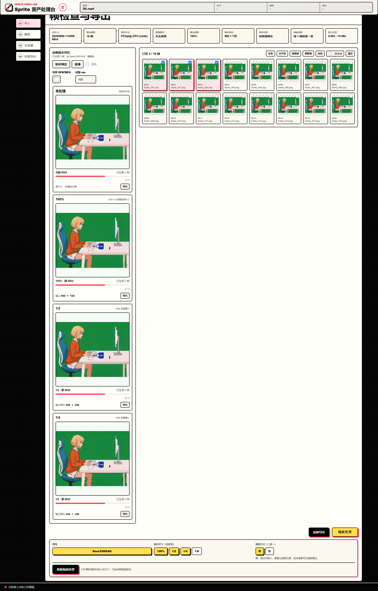
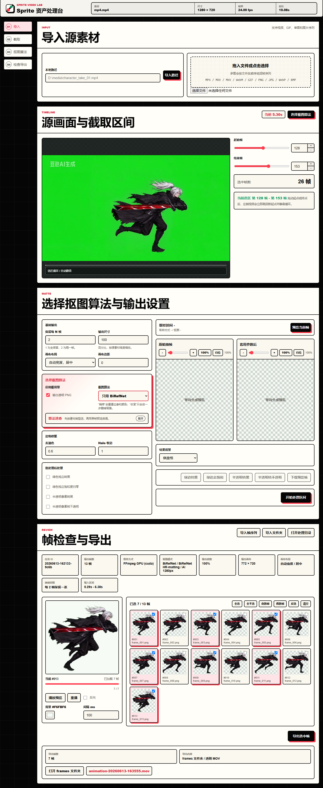

# Sprite Video Lab

Sprite Video Lab 是一个本地网页工具，用来把视频片段、单张图片或已有序列帧整理成干净的 2D Sprite 资源。

## 最新界面调整

去背景与取样设置已压缩到同一区域：`每 N 帧保留一帧` 位于取样栏，基础输出区已移除，背景残留后处理支持自动识别的绿色、洋红等背景色。



帧检查采用左侧竖排动画版本、右侧帧筛选的布局；未处理原版始终保留，Real-ESRGAN 可额外输出 100%、1/2、1/4、1/8，并为每个版本独立导出。



它适合这些工作流：

- 导入本地视频、GIF 动图、单张图片或一次性多图序列帧。
- 截取有用的帧范围。
- 按固定间隔抽帧。
- 去除纯色背景、绿幕/蓝幕背景或 AI 生成背景。
- 用 Luma 保留发光、火焰、闪电、粒子等亮部特效。
- 统一帧尺寸，默认保留源画布，也支持方形落地/居中画布。
- 对已处理帧执行缩放处理：原版始终保留，可选 Real-ESRGAN anime x4 超分，并多选输出 100%、1/2、1/4、1/8。
- 按需导出 Frames、Spritesheet、透明 MOV 或 GIF，不会自动生成未选择的格式。

项目优先服务 Windows 本地工作流，但运行时很轻：Python、Pillow、ffmpeg，以及原生 HTML/CSS/JavaScript。

## 界面全貌



## 功能

- 本地路径导入和拖拽上传。
- 视频区间预览，支持按帧设置起止位置。
- 批处理前先单帧预览参数效果。
- 默认保留源视频/图片画布，方便后续动画对齐。
- 纯色/绿幕抠图，程序自动处理阈值、软边、去色溢出和边缘收缩。
- 纯 Chroma 模式可从源画面或色板添加最多 12 个色样，手动模式默认不预置颜色且允许删空；0–180 容差滑条使用浏览器本地像素计算即时刷新，不重置预览缩放、平移或页面位置，其他模式不开放手动背景色与容差。
- Chroma、Luma 和 BiRefNet 会在最终 alpha 上执行 alpha-aware 去溢色；CorridorKey 直接使用 EZ-CorridorKey 的前景重建与去溢色输出。
- BiRefNet AI 主体抠图。
- Luma 亮度抠图，用来保留发光、火焰、闪电、粒子和亮部 VFX。
- EZ-CorridorKey 绿幕处理，可选择 Chroma 或 BiRefNet 生成粗遮罩，再执行去溢色、去散点、垃圾遮罩和边缘细化。
- 单帧预览支持原始抽帧全分辨率查看，处理后预览可切换棋盘格或指定纯色背景。
- 预览和批处理后处理：按照当前自动识别或手动指定的背景色处理残留（支持绿色、洋红等颜色），可将背景残留转黑或把饱和度归零；另支持半透明像素涂黑、半透明像素转不透明。
- BiRefNet 固定使用质量优先的 HR-matting 模型；纯色背景弱蒙版仍可使用内置色键兜底。
- 可直接导入已有动画序列帧，按文件名顺序预览和导出。
- 实验性线稿清理页：支持 Lanczos 缩小和 Real-ESRGAN anime 整线后缩小。
- 反向动画预览和反向导出。
- 缩放处理预览：对选中帧可选择使用 Real-ESRGAN anime 放大后缩小，或直接本地缩放；支持硬边/软边算法切换，并横向对比未处理原版和已选择的 100%、1/2、1/4、1/8 版本。
- 抠图前可选“先做平滑处理”：每帧先用 Real-ESRGAN anime x4 放大，再以 Lanczos 缩回原尺寸，最后进入抠图；不会改变最终画布尺寸，但会明显增加预览与批处理耗时。
- 帧选择、动画预览，以及按需选择 Frames、Spritesheet、透明 MOV 或 GIF 导出。
- Frames 导出会附带 `frames.json`，按最终帧顺序记录每一帧的持续时间。
- Frames、Spritesheet、透明 MOV 和 GIF 生成完成后都会直接打开对应文件夹。
- “去背景”卡片内置可展开的“速查表”，可在设置参数时直接查看画布、抠图、后处理、导出和缩放处理选项的用途。

## 缩放处理

在“检查导出”区域点击 `缩放处理` 后，可用白/黄色按钮选择 Real-ESRGAN、输出尺寸和硬/软算法。未处理原版始终存在，不受尺寸选择影响。选中 `100%` 时，会额外得到一个原尺寸处理版；如果同时启用 Real-ESRGAN，这个版本会先超分 4 倍，再缩回原尺寸，因此页面会同时显示两个原尺寸版本：未处理原版和处理后 100%。尺寸可以多选：

- `100%`：输出画布与原尺寸相同；启用 Real-ESRGAN 时执行 x4 超分后缩回原尺寸。
- `1/2`：输出画布为原尺寸的 1/2。
- `1/4`：输出画布为原尺寸的 1/4。
- `1/8`：输出画布为原尺寸的 1/8。

`硬` / `软` 决定最终缩放算法：

- `硬`：nearest-neighbor 缩小，保留像素硬边缘，适合 Sprite 动画。
- `软`：BOX 缩小，会平滑边缘，适合需要更柔和抗锯齿的素材。

未处理原版和每个处理版本都有独立的“导出”按钮，点击后会在对应预览卡片下方展开 Frames、Sprite Sheet、透明 MOV 和 GIF。导出结果写入 `work/exports/`，而且只生成本次选择的格式。增减帧或调整参数后，旧结果会保留作对照但暂停导出；点击“更新缩放处理”时，只补算新增帧或新增尺寸，未变化的帧和版本直接复用缓存。

## 抠图模式

Sprite Video Lab 目前提供这些背景处理模式：

- `Chroma`：快速处理受控纯色背景，适合绿幕、蓝幕、白底、灰底等素材。
- `Luma`：基于亮度生成 alpha，适合亮部特效、火焰、闪电、粒子等素材。
- `BiRefNet`：AI 主体抠图，适合非纯色背景或生成图背景。
- `CorridorKey`：处理标准绿幕，可选择 Chroma 或 BiRefNet 作为粗遮罩，再使用 EZ-CorridorKey 重建前景颜色、细化 alpha 并执行幕布去溢色。
- `不抠图`：保持原始画面，仅执行尺寸调整和批处理后处理。

灰底、白底、黑底和蓝幕素材优先使用 `Chroma`；需要重建绿幕边缘时选择 `CorridorKey`。

## 环境要求

- Python 3.10+
- Pillow
- ffmpeg / ffprobe
- 可选 AI 环境：
  - PyTorch
  - torchvision
  - transformers
  - huggingface-hub
  - timm 和相关图片依赖
  - CorridorKey 依赖，例如 `safetensors`、OpenCV、NumPy

基础功能只需要 `requirements.txt`。BiRefNet 和 CorridorKey 相关能力需要 `requirements-ai.txt` 里的可选依赖。

## 安装

安装交给 agent 执行，避免手动配置 Python、ffmpeg、AI 依赖和模型缓存时出错。

- Agent 安装说明：[AGENT_INSTALL.md](./AGENT_INSTALL.md)
- AI 抠图细节：[AI_MATTING.md](./AI_MATTING.md)

安装完成后，agent 应启动本地服务并给出访问地址。默认地址：

```text
http://127.0.0.1:8894
```

实验性线稿清理页：

```text
http://127.0.0.1:8894/app/line-cleaner-experiment.html
```

## 使用说明

界面按以下顺序使用：

1. 导入本地视频、GIF、图片或序列帧。
2. 预览素材并设置起止帧。
3. 在取样工具栏设置“每 N 帧保留一帧”，再选择抠图方式；输出固定为原尺寸、原画布且不增加边距。
4. 先预览当前帧，确认效果后开始批处理。
5. 检查并选择需要的帧，按需反向播放，或点击“缩放处理”生成需要的对比版本。
6. 点击“直接导出”导出未处理原版，或在任一对比卡片中点击“导出”；只有选中的格式会开始生成，完成后会直接打开对应文件夹。

抠图方式的用途见上方“抠图模式”；AI 环境和模型细节见 [AI_MATTING.md](./AI_MATTING.md)。

## 环境变量

- `SPRITE_VIDEO_LAB_HOST`
  - 默认：`127.0.0.1`
- `SPRITE_VIDEO_LAB_PORT`
  - 默认：`8894`
- `SPRITE_VIDEO_LAB_FFMPEG_DIR`
  - 可选，包含 `ffmpeg(.exe)` 和 `ffprobe(.exe)` 的目录
- `SPRITE_VIDEO_LAB_FFMPEG_ACCEL`
  - 可选，支持 `auto`、`cpu`、`cuda`、`qsv`、`d3d11va`、`dxva2`
- `SPRITE_VIDEO_LAB_AI_MODEL_CACHE`
  - 可选，Hugging Face / AI 模型缓存目录
- `SPRITE_VIDEO_LAB_CORRIDORKEY_ROOT`
  - 可选，CorridorKey checkout 和 checkpoint 目录
- `SPRITE_VIDEO_LAB_PYTHON`
  - 可选，启动器使用的 Python 可执行文件
- `SPRITE_VIDEO_LAB_REALESRGAN_BIN`
  - 可选，缩放处理、ESR 预平滑和 Real-ESRGAN anime 线稿清理使用的 `realesrgan-ncnn-vulkan` 可执行文件；勾选“先做平滑处理”并确认后，缺失的 Windows 便携包会自动安装到工作目录
- `SPRITE_VIDEO_LAB_REALESRGAN_MODEL_DIR`
  - 可选，包含 `realesrgan-x4plus-anime.param` 和 `.bin` 的模型目录

也可以从命令行覆盖 host 和 port：

```bash
python server.py --host 127.0.0.1 --port 8894
```

## 项目结构

```text
app/                              前端 UI 和浏览器逻辑
app/line-cleaner-experiment.*     实验性线稿缩小清理页面
server.py                         本地 HTTP 服务和处理流水线
AGENT_INSTALL.md                  给 agent 执行的安装和启动说明
requirements.txt                  基础运行依赖
requirements-ai.txt               可选 AI 抠图依赖
setup_ai_runtime.bat              Windows AI 环境安装脚本
start_sprite_video_lab.bat        Windows 启动器
start_sprite_video_lab_portable.bat 便携版启动器
build_portable_bundle.ps1         便携版打包脚本
work/                             运行时输出目录，已被 git 忽略
```

## 注意事项

- 不要把 `work/`、生成帧、测试视频、模型缓存和虚拟环境提交到 git。
- 便携包不预装 AI 模型权重；普通色键和 Luma 流程不会下载模型。
- 第一次选择 BiRefNet 或 CorridorKey 抠图方式时，页面会先弹出确认框，只有确认后才安装所需模型。BiRefNet 只下载 HR-matting 必需文件，CorridorKey 只下载绿幕 checkpoint。
- BiRefNet 通过 Hugging Face 的 `trust_remote_code=True` 加载模型代码；当前 HR-matting 模型和 EZ-CorridorKey 源码、绿幕 checkpoint 均固定到已验证 revision，升级时应显式修改并重新测试。
- CorridorKey 是独立项目，重新分发或用于商业推理服务前请确认它的许可证。

## License

[MIT](./LICENSE)
